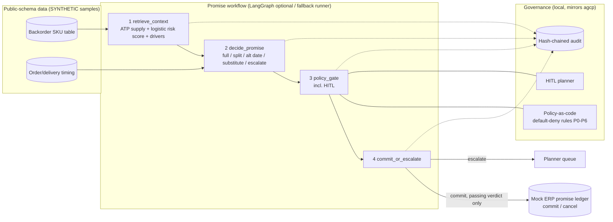

# Component view

```mermaid
flowchart LR
  subgraph Data["Public-schema data (SYNTHETIC samples)"]
    BO[(Backorder SKU table)]
    OL[(Order/delivery timing)]
  end
  subgraph WF["Promise workflow (LangGraph optional / fallback runner)"]
    C[1 retrieve_context<br/>ATP supply + logistic risk score + drivers]
    P[2 decide_promise<br/>full / split / alt date / substitute / escalate]
    G[3 policy_gate<br/>incl. HITL]
    W[4 commit_or_escalate]
  end
  subgraph Gov["Governance (local, mirrors agcp)"]
    PG[Policy-as-code<br/>default-deny rules P0-P6]
    H[HITL planner]
    A[(Hash-chained audit)]
  end
  ERP[(Mock ERP promise ledger<br/>commit / cancel)]
  Q[Planner queue]
  BO --> C --> P --> G --> W
  OL --> P
  G --- PG
  G --- H
  W -->|commit, passing verdict only| ERP
  W -->|escalate| Q
  C & P & G & W -.-> A
```
