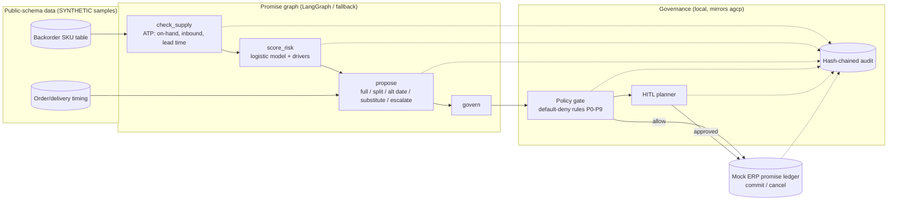

# Component view

```mermaid
flowchart LR
  subgraph Data["Public-schema data (SYNTHETIC samples)"]
    BO[(Backorder SKU table)]
    OL[(Order/delivery timing)]
  end
  subgraph Graph["Promise graph (LangGraph / fallback)"]
    S[check_supply<br/>ATP: on-hand, inbound, lead time]
    R[score_risk<br/>logistic model + drivers]
    P[propose<br/>full / split / alt date / substitute / escalate]
    G[govern]
  end
  subgraph Gov["Governance (local, mirrors agcp)"]
    PG[Policy gate<br/>default-deny rules P0-P9]
    H[HITL planner]
    A[(Hash-chained audit)]
  end
  ERP[(Mock ERP promise ledger<br/>commit / cancel)]
  BO --> S --> R --> P --> G
  OL --> P
  G --> PG --> H
  PG -->|allow| ERP
  H -->|approved| ERP
  S & R & P & PG & H & ERP -.-> A
```
