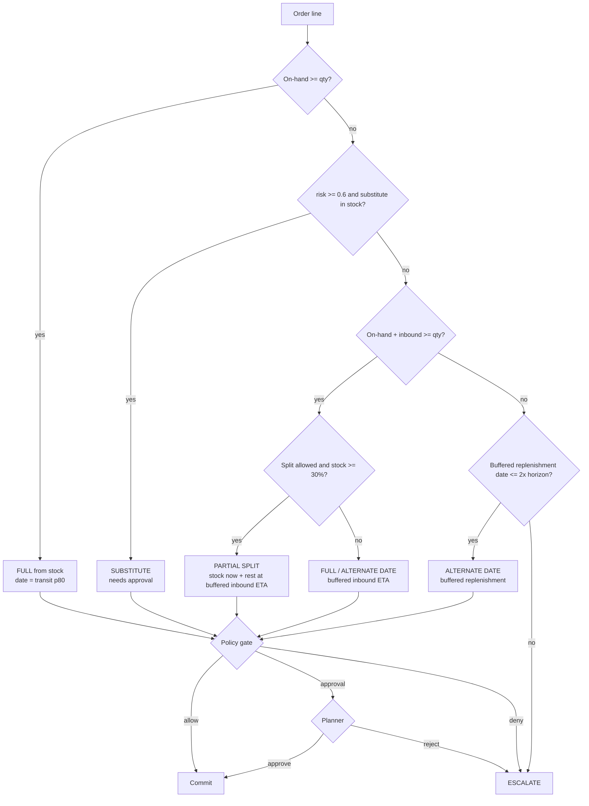

# Promise decision flow

```mermaid
flowchart TD
  A[Order line] --> B{On-hand >= qty?}
  B -- yes --> F1[FULL from stock<br/>date = transit p80]
  B -- no --> C{risk >= 0.6 and substitute in stock?}
  C -- yes --> F2[SUBSTITUTE<br/>needs approval]
  C -- no --> D{On-hand + inbound >= qty?}
  D -- yes --> E{Split allowed and stock >= 30%?}
  E -- yes --> F3[PARTIAL SPLIT<br/>stock now + rest at buffered inbound ETA]
  E -- no --> F4[FULL / ALTERNATE DATE<br/>buffered inbound ETA]
  D -- no --> G{Buffered replenishment date <= 2x horizon?}
  G -- yes --> F5[ALTERNATE DATE<br/>buffered replenishment]
  G -- no --> F6[ESCALATE]
  F1 & F2 & F3 & F4 & F5 --> PG{Policy gate}
  PG -- allow --> C1[Commit]
  PG -- approval --> H{Planner}
  H -- approve --> C1
  H -- reject --> F6
  PG -- deny --> F6
```
