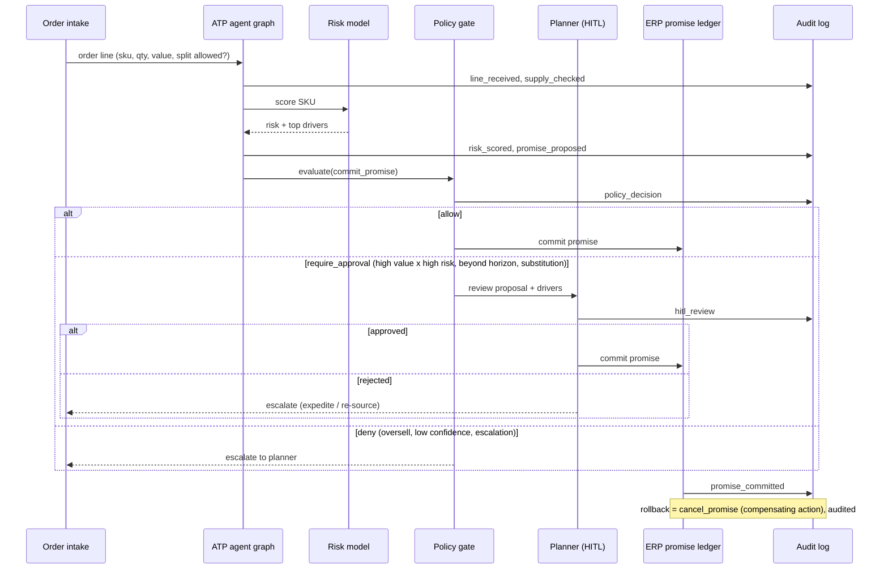

# Sequence: policy gate and HITL before commit

```mermaid
sequenceDiagram
  participant OM as Order intake
  participant AG as ATP agent graph
  participant RM as Risk model
  participant PG as Policy gate
  participant PL as Planner (HITL)
  participant ERP as ERP promise ledger
  participant AU as Audit log
  OM->>AG: order line (sku, qty, value, split allowed?)
  AG->>AU: line_received, supply_checked
  AG->>RM: score SKU
  RM-->>AG: risk + top drivers
  AG->>AU: risk_scored, promise_proposed
  AG->>PG: evaluate(commit_promise)
  PG->>AU: policy_decision
  alt allow
    PG->>ERP: commit promise
  else require_approval (high value x high risk, beyond horizon, substitution)
    PG->>PL: review proposal + drivers
    PL->>AU: hitl_review
    alt approved
      PL->>ERP: commit promise
    else rejected
      PL-->>OM: escalate (expedite / re-source)
    end
  else deny (oversell, low confidence, escalation)
    PG-->>OM: escalate to planner
  end
  ERP->>AU: promise_committed
  Note over ERP,AU: rollback = cancel_promise (compensating action), audited
```
