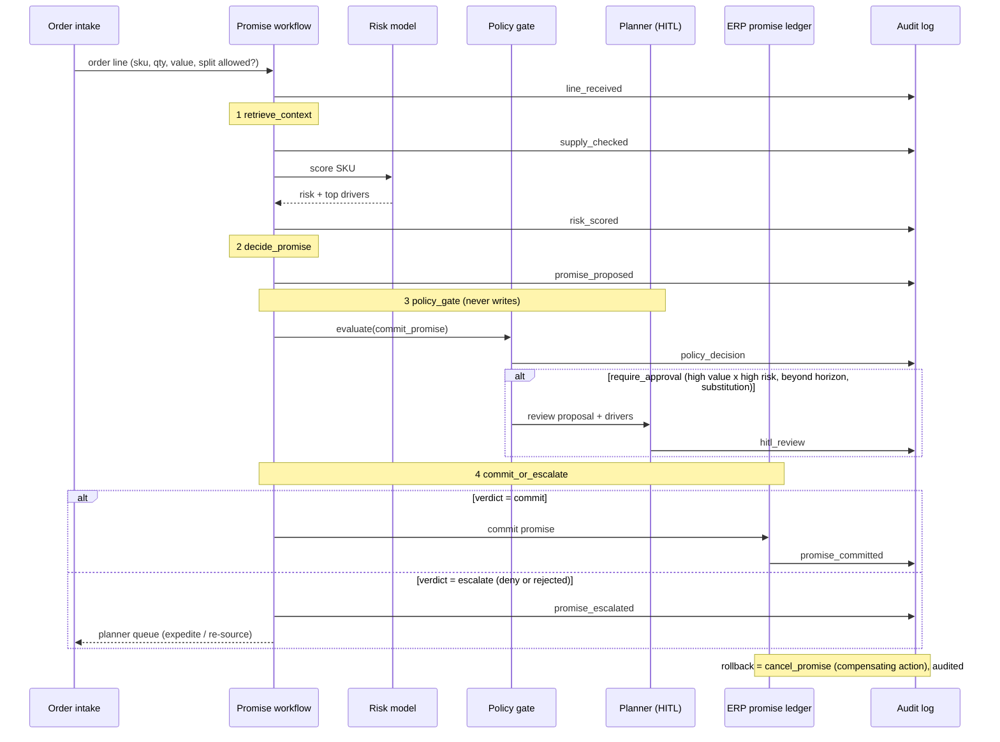

# Sequence: four-step workflow with policy gate and HITL before commit

```mermaid
sequenceDiagram
  participant OM as Order intake
  participant WF as Promise workflow
  participant RM as Risk model
  participant PG as Policy gate
  participant PL as Planner (HITL)
  participant ERP as ERP promise ledger
  participant AU as Audit log
  OM->>WF: order line (sku, qty, value, split allowed?)
  WF->>AU: line_received
  Note over WF: 1 retrieve_context
  WF->>AU: supply_checked
  WF->>RM: score SKU
  RM-->>WF: risk + top drivers
  WF->>AU: risk_scored
  Note over WF: 2 decide_promise
  WF->>AU: promise_proposed
  Note over WF,PL: 3 policy_gate (never writes)
  WF->>PG: evaluate(commit_promise)
  PG->>AU: policy_decision
  alt require_approval (high value x high risk, beyond horizon, substitution)
    PG->>PL: review proposal + drivers
    PL->>AU: hitl_review
  end
  Note over WF,ERP: 4 commit_or_escalate
  alt verdict = commit
    WF->>ERP: commit promise
    ERP->>AU: promise_committed
  else verdict = escalate (deny or rejected)
    WF->>AU: promise_escalated
    WF-->>OM: planner queue (expedite / re-source)
  end
  Note over ERP,AU: rollback = cancel_promise (compensating action), audited
```
